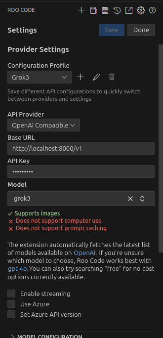

# Grok3-API

A simple, unofficial Python script to interact with the Grok interface (powered by xAI) via browser automation. This project now includes an experimental OpenAI-compatible API server (`server.py`) that simulates an API endpoint, allowing integration with code editors and tools like Cline or Roo Code. The script opens a separate browser window, sends messages and files (e.g., images) to Grok, and retrieves responses using clipboard and UI automation. It was written with a little help from Grok itself!

> **Note**: This is a modest, experimental script with no warranties. All rights to Grok and its underlying technology belong to xAI.

## Features
- Send text messages to Grok.
- Upload files (e.g., images) along with messages.
- Retrieve responses via clipboard automation.
- Works only on Linux due to dependency on `xdotool` and related tools.
- New: OpenAI-compatible API server (`server.py`) for integration with code editors and AI tools like Cline or Roo Code, enabling advanced workflows such as coding assistance, file manipulation, and more.

## Prerequisites
This script is designed for **Linux** systems only. It relies on the following dependencies:
- Python 3.6+
- `xdotool` - for window and mouse/keyboard automation
- `xclip` - for clipboard management
- `imagemagick` - for image conversion
- Additional Python libraries (see installation steps)
- An active Grok account at [grok.com](https://grok.com) (you’ll need to log in manually).

## Installation

1. **Clone the repository**:
   ```bash
   git clone https://github.com/DragonsWho/grok3_api.git
   cd grok3-api
   ```

2. **Set up a virtual environment** (optional but recommended):
   ```bash
   python3 -m venv venv
   source venv/bin/activate
   ```

3. **Install Python dependencies**:
   ```bash
   pip install -r requirements.txt
   ```
   (The `requirements.txt` includes: `pyperclip`, `opencv-python`, `numpy`, `mss`, `mimetypes`, `fastapi`, `uvicorn`, `pydantic` for the API server.)

4. **Install system dependencies**:
   On a Debian/Ubuntu-based system:
   ```bash
   sudo apt update
   sudo apt install xdotool xclip imagemagick
   ```

5. **Log in to Grok**:
   - Open [grok.com](https://grok.com) in your browser and log in to your xAI account. The script will open a separate browser window and interact with this page, so keep your session active.

## Usage

### Using the Original Script (`grok3_api.py`)
Run the script from the command line:
```bash
python grok3_api.py "Your message here" [file1] [file2] ...
```
Example:
```bash
python grok3_api.py "What’s on this picture? Where is this mountain?" public/test.png
```

#### Options
- `--reuse-window` or `-rw`: Reuse an existing browser window.
- `--no-close` or `-nc`: Keep the browser window open after execution.

### Using the OpenAI-Compatible API Server (`server.py`)
The `server.py` script introduces an OpenAI-compatible API server that simulates Grok’s functionality, allowing integration with tools like Cline or Roo Code. Here’s how to set it up and use it:

1. **Run the Server**:
   ```bash
   python server.py
   ```
   This starts a FastAPI server on `http://localhost:8000/v1`, which acts as an OpenAI-compatible endpoint.

2. **Open Grok in Your Browser**:
   - Open [grok.com](https://grok.com) in your browser and ensure you’re logged in. The server will interact with this session via browser automation.

3. **Configure Your Tool (e.g., Cline or Roo Code)**:
   Use the following settings in your tool (e.g., Roo Code or Cline) to connect to the API:
   - **API Provider**: OpenAI Compatible
   - **Base URL**: `http://localhost:8000/v1`
   - **API Key**: Any string (e.g., `dummy-key`—the server doesn’t check it)
   - **Model**: `grok3`
   - **Streaming**: Disable (uncheck "Enable streaming")
   - **Additional Notes**:
     - Ensure the tool supports OpenAI-compatible APIs.
     - The server supports sending text messages and files, but does not support computer use, image generation, or prompt caching (as noted in the configuration screenshot).



4. **Interact with Grok**:
   - In your tool, send commands or requests as you would with an OpenAI API. For example, in Cline or Roo Code, enter a command like `/ask "Write a snake game in python"`.
   - Avoid moving the mouse too much during operation, as the script uses automated clipboard and UI interactions that could be interrupted.

5. **Important Notes**:
   - The server logs all requests and responses to `grok3_api.log` for debugging.
   - If you encounter issues, check the log file or ensure dependencies (`xdotool`, `xclip`, `imagemagick`) are installed and Grok’s UI hasn’t changed.

## How It Works

### Original Script (`grok3_api.py`)
Since Grok doesn’t provide an official API, the original script uses browser automation:
- It opens a new browser window to [grok.com](https://grok.com).
- It interacts with the page by simulating clicks and keystrokes using `xdotool`.
- Messages and files are sent via the clipboard and UI elements (e.g., input fields, buttons).
- Responses are retrieved by copying text from the Grok interface.

### OpenAI-Compatible API Server (`server.py`)
The `server.py` script enhances the original functionality by providing an OpenAI-compatible API endpoint:
- It uses FastAPI to create a server that listens on `http://localhost:8000/v1`.
- It leverages the `GrokAPI` class (from `grok3_api.py`) to interact with Grok via browser automation.
- Requests are sent as JSON payloads (e.g., `ChatRequest` with messages, files, and model details) and formatted to match OpenAI’s `chat/completions` endpoint.
- Responses are returned in OpenAI-compatible JSON format, allowing integration with tools like Roo Code or Cline.
- The server handles file uploads, message parsing, and error logging, but requires an active Grok session in the browser.

## Limitations
- **Linux-only**: Depends on `xdotool`, `xclip`, and `imagemagick`.
- **Manual Setup**: Requires UI templates and an active logged-in session on [grok.com](https://grok.com).
- **Rate Limits**: Heavy use will quickly hit Grok’s request limits, potentially locking you out temporarily. Consider a premium subscription to Grok for better access.
- **No Official API**: This is a workaround due to the lack of a proper API from xAI.
- **Fragile**: May break if Grok’s UI changes significantly. You can update the UI templates in the code if needed.
- **API Server Limitations**: The `server.py` script does not support computer use, image generation, or prompt caching. Streaming is also disabled for stability.

## Recommendations
For a smoother experience, consider purchasing a **premium subscription to Grok** on [grok.com](https://grok.com). This may increase your rate limits and reduce interruptions from hitting free-tier caps.

## Disclaimer
This script is an unofficial, community-driven effort and comes with **no guarantees** of functionality, reliability, or compatibility with future Grok updates. All intellectual property rights related to Grok belong to **xAI**. Use at your own risk! If you overuse this script, you’ll likely exhaust your free-tier limits quickly.

## Credits
- Written with assistance from Grok, created by xAI. Seriously, he did most of the work.